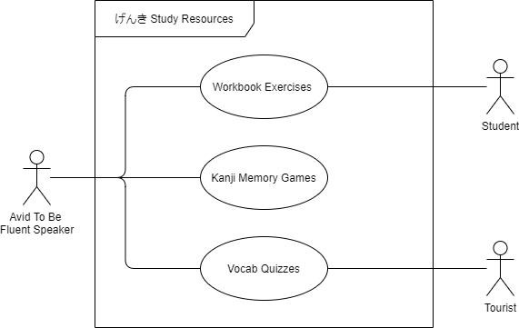

Blake Patterson

# げんき Study Resources

## Project Abstract
げんき (Genki) Study Resources is an open source web app for studying Japanese alongside the げんき textbook
owned and maintained by [Seth Clydesdale](https://github.com/SethClydesdale) as well as other contributors. 
It contains some of the content from each of the lessons in げんき including the vocab and grammar, but not the lessons themselves.
It doesn't even have actual definitions or grammar rules listed anywhere, it is strictly a set of different types of practice quizzes (drag & drop, multiple choice, etc.) and other random exercises. 
Thus, it is merely meant as a supplemental tool for practice alongside the textbook itself, it is not meant to be used as a sole resource for learning Japanese. 
The use case is mainly for people who have gone through the lesson in the textbook and done the speaking, reading, and writing practice there, but still want more practice outside of that to strengthen their memory of vocab, grammar rules, and kanji. 

For example, a student might just want to do the workbook exercises since that is what they will be graded on in their class, but a tourist might just want to review the vocab after seeing it in the textbook since they only need surface level knowledge for their trip. 
In contrast, anyone who yearns to be a fluent speaker could consistently work through all of the exercises, even the kanji games I plan to implement. 

## Project Relevance
This project could easily tie into test driven development, unified modeling language (UML), design patterns, code profiling and optimization, graphic user interface, and access to database. 
Test driven development might not be as prevalent here as in a Java project since we cannot write JUnit tests, but we can keep seperate index.html pages not reachable from the main app specifically for testing purposes. 
UML & design patters could come in really handy here in the early stages of development since I want to completely reorganize the way this project is structured, thus we could make use of UML and design pattern theories to achieve this goal. 
Code profiling and optimization could also really come in handy for the previous point, not so much to make the code run faster as there is not too much going on, but more so to clean up the code and make it easier to maintain. 
Graphic user interfaces are a pretty obvious point here as I want to take UI/UX design into account when redesigning the menus as well as when designing the games, since the UI/UX is one of the most important parts of any game. 
Finally database access could play a huge role in the development of this project when implementing the leaderboards. Currently this is just a standalone web app with no database, so this project could lead to great experience in setting up and designing database tables. 
I'm sure there are other ways many of the class concepts could tie into this project, but these are the ones that stand out to me at the moment.

## Conceptual Design
I mainly want to add some game elements to this app with a scoring system that people can use to practice. 
It takes countless hours of practice to learn a new language and Japanese is among the hardest to learn, there are literally thousands of characters to memorize.
Simply doing drag and drop or multiple choice quizzes for all of those characters gets boring pretty quick, so I want to make it more enjoyable. 
I am currently thinking along the lines of a typing game and a card memorization game, but I am open to any and all suggestions.
For example, I want to implement the card memorization game where every card is face down, you get to flip two cards at a time, and you have to match two cards, but for kanji.
So instead of pairing exact matches, one card in a pair would have the kanji itself, and the other card would have the furigana along with the definition. 
 

After adding some games, I would also like to make it more competitive by adding some sort of leaderboard system. 
This would be far more complex, as it would require setting up a database to keep user information and maintain the leaderboards, but I think it might be worth it.
When there is no incentive other than the goal of memorizing something, even games can get boring. 
However, when there is the incentive of competition, many people cannot give up so easily, myself included. 
 

I also want to make numerous quality of life imporvements throughout the app, mainly the organization and navigation. 
Currently it is just a long list of links and tons of index.html pages, so I hope to make it more user friendly.
Also, the third edition of the げんき textbook was released last year, leading the creator to branch off into having two seperate versions within the same repo.
There seems to be many things they have worked on and only implemented in the third edition, even though both editions have the same JS source files. 
Thus, I would like to update and maintain the second edition so people without access to the third edition textbook can make use of these new features 
(The third edition is much more expensive and many classes still use the second edition).

## Background
[げんき Study Resources](https://sethclydesdale.github.io/genki-study-resources/)  
[GitHub Repo](https://github.com/SethClydesdale/genki-study-resources)  

#### Building 
- As this is just a web app built written in HTML and JS, there is no building required, just a web browser
- Click the download link at either the top of the app or in the README of the repo
- Unzip the files
- Move the files out of the zipped folder to somewhere else on your computer (This step is necessary)
- Open the folder and open the index.html file

#### Running
- Go to the link 

    **_OR_**

- Download the files, unzip them, and open any of the index.html files in the browser of your choice

I have been using Windows 10 and the most up to date version of Chrome and have had no issues, although there is a note about icons not working with Firefox in the README.
I have not seen anything regarding problems with Safari, although in my experience Safari can work very differently than Chrome, so I recommend using Chrome. 

## Required Resources
#### Skills required
  - HTML/CSS/JS
  - Knowledge in any web development frameworks or libraries (e.g. React, Angular, Vue, Bootstrap, Bulma, etc) is preferred
#### Hardware and software resources required
  - A computer
  - A text editor
  - A web browser

## Links
- げんき Study Resources: https://sethclydesdale.github.io/genki-study-resources/
- げんき Study Resources GitHub Repo: https://github.com/SethClydesdale/genki-study-resources
